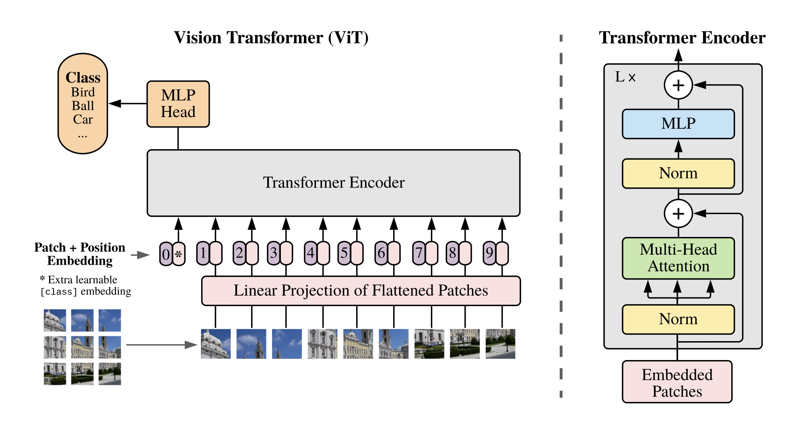
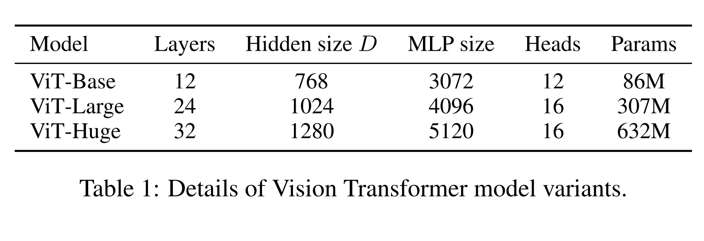
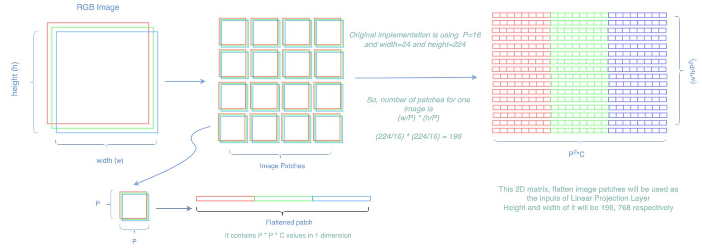
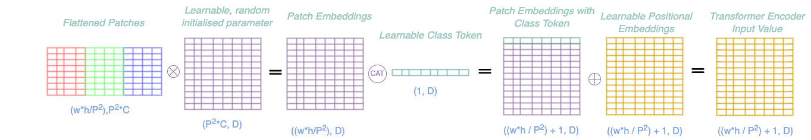
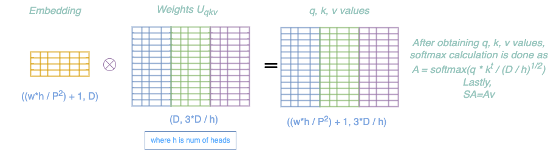

## Step by step Implementation of Vision Transformers in PyTorch

In this notebook, I systematically implemented the stages of the Vision Transformers (ViT) model, combining them to construct the entire ViT architecture. The figure above, sourced from the original ViT paper titled "An Image is Worth 16x16 Words: Transformers for Image Recognition at Scale" (ICLR 2021), illustrates crucial components like image patches, positional embeddings, learnable class embeddings, linear projection, multi-head attention, and MLP head.
<div style="text-align:center">
    
</div>
After reviewing this notebook, you will gain a clear understanding of each stage and be able to answer the following questions:

- Overview of the ViT architecture
- Explanation of image patches, class tokens, positional embeddings, Self-Attention, Multi-Head Attention, Linear Projection
- Process of creating image patches
- Initialization of class tokens and positional embeddings and their combination with image patches
- Mathematical details of the Self-Attention mechanism
- Construction of the Multi-Head Attention model from the Self-Attention layer/function

The entire implementation is carried out using the Torch framework, and the Pillow library is utilized for loading and resizing images to the desired dimensions.


```python
# Imports
import math
import torch
from PIL import Image
from torch import nn
from torch.nn import functional as F
from torchvision import transforms as T
```

The authors conducted experiments using three different architectures by modifying the parameters, as indicated in the table below. In this notebook, ViT-Base will be implemented, and the parameters initialized in the next cell are configured accordingly for that model.
<div style="text-align:center">
    
</div>


```python
# Introduce some parameters
desired_image_size = 224   # The desired size is 224 as mentioned in the paper
B = batch_size = 2                        # Batch Size
P = patch_size = 16                       # patch size
C = num_channels = 3                      # number of channels (RGB)
D = embedding_dim = 768                   # dimension of the patch embeddings
num_layers = 12                           # Number of layers in ViT model
num_heads = 12                            # Number of heads in ViT model
hidden_dim = 3072                         # hidden layer dimension in MLP
```


```python
# Load an image from a file and resize it.
image = Image.open('./images/photo.jpg')
image = image.resize((desired_image_size, desired_image_size))
print(f'Image size:{image.size} and mode:{image.mode}. Image should be an RGB image with size of (224,224).')
assert image.size == (224, 224)
assert image.mode == 'RGB'
```

    Image size:(224, 224) and mode:RGB. Image should be an RGB image with size of (224,224).


```python
# Transform the Pillow image into a Torch tensor and generate a batch by replicating it. Initiating with a batched tensor is crucial 
# to ensure that our implementation accommodates batches.

image_tensor = T.PILToTensor()(image) # torch tensor

image_batch = torch.stack([image_tensor for _ in range(B)])
print(f'Shape of the tensor, (B, C, W, H): {list(image_batch.shape)}')
assert list(image_batch.shape) == [2, 3, 224, 224]
```

    Shape of the tensor, (B, C, W, H): [2, 3, 224, 224]


Figure below shows the mathematical calculation of the image patches only for one image. In the implementation, batch supported version is implemented.
<div style="text-align:center">
    
</div>
Patches are generated from the given image with a size of 16x16 without overlapping. In this case, the number of patches created is calculated as (224/16) * (224/16) = 196. As the transformer architecture doesn't accept 3D/4D inputs, each patch is flattened and stacked together. This results in 2D patches with a size of (196, (patch_size * patch_size * number of channels)). 

For our configuration, this translates to (196, (16*16*3)) = (196, 768)


```python
# Set the number of patches and patch_dimension to use later as the expected values
number_of_patches = int((desired_image_size * desired_image_size)/ (P * P))
assert number_of_patches == 196
patch_dim = int(P * P * C)
assert patch_dim == 768
```


```python
# Create patches and apply flatten operation
# With the batch support the operation becomes this in Torch
# Credit: # https://discuss.pytorch.org/t/how-to-extract-patches-from-an-image/79923/4
unfolded_batch = image_batch.unfold(1, C, C).unfold(2, P, P).unfold(3, P, P) 
flattened_patches = unfolded_batch.contiguous().view(B, -1, C * P * P).float()

print(f"Shape of one flattened Patch: {flattened_patches[0].shape}")
assert list(flattened_patches.shape) == [B, number_of_patches, patch_dim]
```

    Shape of one flattened Patch: torch.Size([196, 768])


After obtaining flattened patches, patch embeddings are generated by multiplying the patches with learnable parameters. This multiplication transforms the dimension of the patches to the desired dimension, denoted as D. Following this, similar to the approach in the BERT paper, learnable class tokens are prepended to the patch embeddings. Lastly, learnable positional embeddings are added, and the output of this process serves as the input to the Transformer Encoder model.
<div style="text-align:center">
    
</div>

The Linear Projection step involves transforming flattened patch embeddings into a higher-dimensional space using a learnable weight matrix and bias vector. This process enhances the model's capacity to capture complex patterns and features in the image. The output of this step, along with learnable class tokens and positional embeddings, serves as the input to the Transformer Encoder model.


```python
# Linear Projection process
patch_weights = nn.Parameter(torch.empty(P * P * C, D).normal_(std=0.02))

patch_embeddings = torch.matmul(flattened_patches, patch_weights)
print(f'Patch Embeddings Shape after multiplying flattened patches with learnable parameter: {list(patch_embeddings.shape)}')
assert patch_embeddings.shape == (B, number_of_patches, D)
```

    Patch Embeddings Shape after multiplying flattened patches with learnable parameter: [2, 196, 768]


The class token serves as a learnable parameter that provides a global representation for the entire image. It captures global information and is combined with patch embeddings before being input to the Transformer Encoder. The class token aids in developing a semantic understanding of the image, complementing local features and providing a holistic context.


```python
# Initialisation of Class Token
class_token = nn.Parameter(torch.empty(1, 1, D).normal_(std=0.02))

batch_class_token = class_token.expand(B, -1, -1)
patch_embeddings_with_class_token = torch.cat([batch_class_token, patch_embeddings], dim=1)

print(f'Patch Embeddings + Class Token should have a shape of (B, number_of_patches + 1, D): {list(patch_embeddings_with_class_token.shape)}')
assert patch_embeddings_with_class_token.shape == (B, number_of_patches + 1, D)
```

    Patch Embeddings + Class Token should have a shape of (B, number_of_patches + 1, D): [2, 197, 768]


Position embeddings are learnable vectors that encode the spatial positions of patches in the input sequence. Added to patch embeddings, they provide crucial spatial information, allowing the model to understand the sequential order and relationships between patches. Position embeddings enable the Transformer to attend to spatial positions during self-attention, enhancing the model's ability to capture contextual information in visual tasks.


```python
# Addition of the Positional Embeddings to Patch Embeddings with Class Tokens.
positional_embedding = nn.Parameter(torch.empty(B, number_of_patches + 1, D).normal_(std=0.02))

embeddings = patch_embeddings_with_class_token + positional_embedding

print(f'Embeddings shape which are ready to be fed to Transformer model: {embeddings.shape}')
assert embeddings.shape == (B, number_of_patches + 1, D)
```

    Embeddings shape which are ready to be fed to Transformer model: torch.Size([2, 197, 768])


Self-Attention mechanism allows the model to weigh the importance of different elements in a sequence when processing each element.
It contains three vectors called Key, Query, and Value Vectors. 
Each input element (token or patch) is associated with three vectors:
- Query (Q): Represents the element's information.
- Key (K): Helps the model understand the relationships between elements.
- Value (V): Holds the actual information associated with the element.
<div style="text-align:center">
    
</div>
Scores are computed by dot products of Q and K, then scaled and softmaxed to obtain attention weights. These weights determine the importance of each element. The weighted sum of Values produces a context vector.

Self-Attention enables the model to understand spatial dependencies and features in image patches, considering both local and global context.


```python
# Functional implementation which can't be attached to the Torch Module. 
qkv_dim = int(D / num_heads) 
# The dimensions of the Query, Key, and Value matrices are determined by the embedding dimension. 
# Ignoring the batch dimension, their first dimensions match the embedding dimension, while 
# the second dimension is calculated based on the number of heads in the architecture.

W = nn.Parameter(torch.empty(1, D, int(3 * qkv_dim)).normal_(std=0.02))

# calculate query, key and value projection
qkv = torch.matmul(embeddings, W)
q = qkv[:, :, :qkv_dim]
k = qkv[:, :, qkv_dim:qkv_dim*2 ]
v = qkv[:, :, qkv_dim*2:]

# Calculate attention weights by applying a softmax to the dot product of all queries with all keys
attention_weights = F.softmax(torch.matmul(q, torch.transpose(k, -2, -1) ) / math.sqrt(qkv_dim), dim=1)

# calculate attention values
attention_values = torch.matmul(attention_weights, v)

print(f'Shape of the Attention values: {attention_values.shape}')
assert attention_values.shape == (B, number_of_patches + 1, qkv_dim)
```

    Shape of the Attention values: torch.Size([2, 197, 64])


As Self-Attention is used several times in Multi-Head Attention, it will be wise to convert it to a Torch Module as below.


```python
# Self Attention Module
class SelfAttention(nn.Module):
    def __init__(self, embedding_dim, qkv_dim):
        super(SelfAttention, self).__init__()

        self.embedding_dim = embedding_dim   # embedding dimension
        self.qkv_dim = qkv_dim               # Dimension of key, query, value

        self.W = nn.Parameter(torch.empty(1, embedding_dim, int(3 * qkv_dim)).normal_(std=0.02))

    def forward(self, embeddings):

        # calculate query, key and value projection
        qkv = torch.matmul(embeddings, self.W)
        q = qkv[:, :, :self.qkv_dim]
        k = qkv[:, :, self.qkv_dim:self.qkv_dim*2 ]
        v = qkv[:, :, self.qkv_dim*2:]
        
        # Calculate attention weights by applying a softmax to the dot product of all queries with all keys
        attention_weights = F.softmax(torch.matmul(q, torch.transpose(k, -2, -1) ) / math.sqrt(self.qkv_dim), dim=1)
        
        # calculate attention values and return
        return torch.matmul(attention_weights, v)
```


```python
# initialise self-attention object
self_attention = SelfAttention(embedding_dim=D, qkv_dim=int(3 * qkv_dim)) 

attention_values = self_attention(embeddings)

print(f'Shape of the Attention values: {attention_values.shape}')
assert attention_values.shape == (B, number_of_patches + 1, int(3 * qkv_dim))
```

    Shape of the Attention values: torch.Size([2, 197, 192])


Multi-head attention module enhances the model's capability by allowing it to focus on various aspects of input patches simultaneously. It involves linear projections of Query (Q), Key (K), and Value (V) vectors for each attention head (as implemented above), followed by independent scaled dot-product attention computations. The outputs from different heads are concatenated, linearly transformed, and serve as the final result, enabling the model to capture diverse features and relationships in the input image patches.


```python
# Multi-Head Attention Module
class MultiHeadAttention(nn.Module):
    def __init__(self, embedding_dim, num_heads):
        super(MultiHeadAttention, self).__init__()

        self.num_heads = num_heads            
        self.embedding_dim = embedding_dim    # embedding dimension

        self.qkv_dim = embedding_dim // num_heads   # Dimension of key, query, and value can be calculated with embedding_dim and num_of_heads

        # initialise self-attention modules num_heads times
        self.multi_head_attention = nn.ModuleList([SelfAttention(embedding_dim, self.qkv_dim) for _ in range(num_heads)])

        # initialise weight matrix. 
        self.W = nn.Parameter(torch.empty(1, num_heads * self.qkv_dim, embedding_dim).normal_(std=0.02))

    def forward(self, x):
        # self-attention scores for each head
        attention_scores = [attention(x) for attention in self.multi_head_attention]

        # The outputs from all attention heads are concatenated and linearly transformed. 
        Z = torch.cat(attention_scores, -1)

        # This step ensures that the model can consider a comprehensive set of relationships captured by different heads.
        return torch.matmul(Z, self.W)
```


```python
# initialise Multi-Head Attention object
multi_head_attention = MultiHeadAttention(D, num_heads)

# calculate Multi-Head Attention score
multi_head_attention_score = multi_head_attention(patch_embeddings_with_class_token)

print(f'Shape of the Multi-Head Attention: {multi_head_attention_score.shape}')
assert multi_head_attention_score.shape == (B, number_of_patches + 1, D)
```

    Shape of the Multi-Head Attention: torch.Size([2, 197, 768])


The MLP module enhances the model's representation by applying linear transformations, non-linear activation functions, and a final linear transformation to the multi-head attention scores. 
It introduces non-linearity, enabling the model to capture complex patterns and relationships within the data.
This step further refines the representation and prepares it for subsequent layers in the architecture.


```python
class MLP(nn.Module):
    def __init__(self, embedding_dim, hidden_dim):
        super(MLP, self).__init__()

        self.mlp = nn.Sequential(
                            nn.Linear(embedding_dim, hidden_dim),
                            nn.GELU(),
                            nn.Linear(hidden_dim, embedding_dim)
                   )

    def forward(self, x):
        return self.mlp(x)
```


```python
# initialise MLP object
mlp = MLP(D, hidden_dim)

output = mlp(multi_head_attention_score)

assert output.shape == (B, number_of_patches + 1, D)
print(F'Shape of MLP output: {output.shape}')
```

    Shape of MLP output: torch.Size([2, 197, 768])


Having implemented all the essential functionalities step by step, we can now introduce the Transformer Encoder Module by combining the necessary functions.


```python
# Transformer Encoder Module
class TransformerEncoder(nn.Module):
    def __init__(self, embedding_dim, num_heads, hidden_dim, dropout):
        super(TransformerEncoder, self).__init__()

        self.multi_head_attention = MultiHeadAttention(embedding_dim, num_heads)
        self.mlp = MLP(embedding_dim, hidden_dim)

        self.layer_norm1 = nn.LayerNorm(embedding_dim)
        self.layer_norm2 = nn.LayerNorm(embedding_dim)

        self.dropout1 = nn.Dropout(p=dropout)
        self.dropout2 = nn.Dropout(p=dropout)
        self.dropout3 = nn.Dropout(p=dropout)

    def forward(self, embeddings):
        # Applying dropout
        dropout_embeddings = self.dropout1(embeddings)
        # Layer normalization
        normalized_embeddings = self.layer_norm1(dropout_embeddings)
        # Calculation of multi-head attention
        attention_scores = self.multi_head_attention(normalized_embeddings)
        # Applying the second dropout
        dropout_attention_scores = self.dropout2(attention_scores)
        # Residual connection with second dropout output and initial input
        residuals_embeddings = embeddings + dropout_attention_scores
        # apply layer normalization
        normalized_residuals_embeddings = self.layer_norm2(residuals_embeddings)
        # aply MLP 
        transformed_results = self.mlp(normalized_residuals_embeddings)
        # Applying the third dropout
        dropout_transformed_results = self.dropout3(transformed_results)
        # Residual connection with last dropout output and first residual output
        output = residuals_embeddings + dropout_transformed_results

        return output
```


```python
# init transformer encoder
transformer_encoder = TransformerEncoder(embedding_dim=D, num_heads=num_heads, hidden_dim=hidden_dim, dropout=0.1)

# compute transformer encoder output
output = transformer_encoder(embeddings)

print(f'Shape of the output of Transformer Encoders: {output.shape}')
assert output.shape == (B, number_of_patches + 1, D)
```

    Shape of the output of Transformer Encoders: torch.Size([2, 197, 768])


The output of the Transformer Encoder is a sequence of feature vectors, each corresponding to a specific patch of the input image. These feature vectors capture hierarchical and contextual information learned during the self-attention mechanism within the transformer layers. The final feature sequence is then used for downstream tasks such as classification.

The MLP Head processes the transformer encoder's output by applying global average pooling, a fully connected layer, an activation function (typically softmax), and produces the final probability distribution over classes for classification tasks.


```python
class MLPHead(nn.Module):
    def __init__(self, embedding_dim, num_classes, is_train=True):
        super(MLPHead, self).__init__()
        self.num_classes = num_classes
        # this part is taken from torchvision implementation
        if is_train:
            self.head = nn.Sequential(
                                    nn.Linear(embedding_dim, 3072),  # hidden layer
                                    nn.Tanh(),
                                    nn.Linear(3072, num_classes)    # output layer
                            )
        else:
            # single linear layer
            self.head = nn.Linear(embedding_dim, num_classes)

    def forward(self, x):
        return self.head(x)

```


```python
# Classifier "token" as used by standard language architectures
class_token_output = output[:, 0] 

# initialise number of classes
n_class = 10

# initialise classification head 
mlp_head = MLPHead(D, n_class)

cls_output = mlp_head(class_token_output)

# size of output
print(f'Shape of the MLP Head output: {cls_output.shape}')
assert list(cls_output.shape) == [B, n_class]
```

    Shape of the MLP Head output: torch.Size([2, 10])


At last, implementing the Vision Transformer module which involves utilizing all the functions discussed above in accordance with the visual representations and information provided in the paper.


```python
# VisionTranformer Module
class VisionTransformer(nn.Module):
    def __init__(self, patch_size=16, image_size=224, C=3,
                     num_layers=12, embedding_dim=768, num_heads=12, hidden_dim=3072,
                            dropout_prob=0.1, num_classes=10):
        super(VisionTransformer, self).__init__()

        self.patch_size = patch_size
        self.C = C

        # get the number of patches of the image
        self.num_patches = int(image_size ** 2 / patch_size ** 2) # (width * height) / (patch_size**2)

        # trainable linear projection for mapping dimension of patches (weight matrix E)
        self.W = nn.Parameter(torch.empty(1, patch_size * patch_size * C, embedding_dim).normal_(std=0.02))

        # position embeddings
        self.positional_embeddings = nn.Parameter(torch.empty(1, self.num_patches + 1, embedding_dim).normal_(std=0.02))

        # learnable class tokens
        self.class_tokens = nn.Parameter(torch.rand(1, D))

        # transformer encoder
        self.transformer_encoder = nn.Sequential(*[
            TransformerEncoder(embedding_dim, num_heads, hidden_dim, dropout_prob) for _ in range(num_layers)
        ])

        # mlp head
        self.mlp_head = MLPHead(embedding_dim, num_classes)

    def forward(self, images):
        # get patch size and channel size
        P, C = self.patch_size, self.C

        # create image patches
        patches = images.unfold(1, C, C).unfold(2, P, P).unfold(3, P, P).contiguous().view(images.size(0), -1, C * P * P).float()

        # patch embeddings
        patch_embeddings = torch.matmul(patches , self.W)

        # class token + patch_embeddings
        batch_class_token = self.class_tokens.expand(patch_embeddings.shape[0], -1, -1)
        patch_embeddings_with_class_token = torch.cat([batch_class_token, patch_embeddings], dim=1)

        # add positional embedding
        embeddings = patch_embeddings_with_class_token + self.positional_embeddings

        # execute Transformer encoders
        transformer_encoder_output = self.transformer_encoder(embeddings)

        # Classifier "token" as used by standard language architectures
        output_class_token = transformer_encoder_output[:, 0]

        return self.mlp_head(output_class_token)
```


```python
# init vision transformer model
vision_transformer = VisionTransformer(patch_size=P, 
                                       image_size=desired_image_size, 
                                       C=C,
                                       num_layers=num_layers, 
                                       embedding_dim=embedding_dim, 
                                       num_heads=num_heads, 
                                       hidden_dim=hidden_dim, 
                                       dropout_prob=0.1, 
                                       num_classes=10)

# we can use image_batch as it is
vit_output = vision_transformer(image_batch)

assert vit_output.size(dim=1) == n_class
print(vit_output.shape)
```

    torch.Size([2, 10])


```python

```
